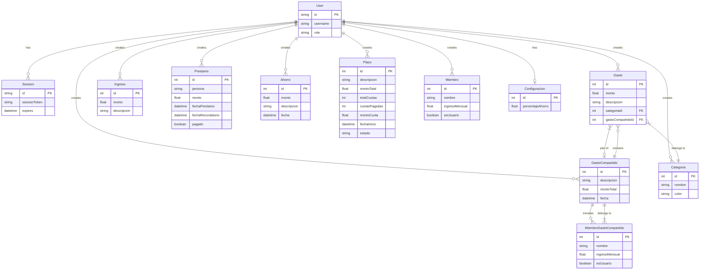

# Estructura de la Base de Datos

La aplicación utiliza PostgreSQL como base de datos relacional y Prisma como ORM.

## Modelos Principales

### Usuarios y Autenticación
- **User**: Almacena la información de los usuarios (nombre, username, contraseña hasheada, rol).
- **Session**: Gestiona las sesiones de usuario para la autenticación.

### Finanzas
- **Ingreso**: Registros de ingresos monetarios.
- **Gasto**: Registros de gastos, vinculados a una categoría.
- **Categoria**: Categorías para clasificar los gastos (ej: Comida, Transporte).
- **Ahorro**: Registros de ahorros.
- **Prestamo**: Gestión de préstamos personales (dinero prestado a otros).
- **Plazo**: Gestión de compras a plazos o deudas.

### Gastos Compartidos
- **GastoCompartido**: Un gasto que se divide entre varios miembros.
- **Miembro**: Personas que participan en los gastos compartidos.
- **MiembroGastoCompartido**: Snapshot de la participación de un miembro en un gasto específico en el momento de su creación.

### Configuración
- **Configuracion**: Preferencias del usuario (ej: porcentaje de ahorro objetivo).

## Diagrama Entidad-Relación

## Relaciones Clave
- Todos los modelos financieros (`Gasto`, `Ingreso`, etc.) están vinculados a un `User` mediante `userId`, asegurando el aislamiento de datos.
- Los `Gastos` pueden estar vinculados a un `GastoCompartido` para reflejar la parte proporcional que le corresponde al usuario.
