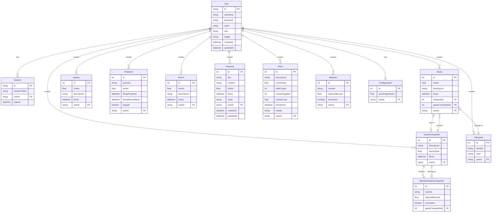

# Estructura de la Base de Datos

La aplicación utiliza PostgreSQL como base de datos relacional y Prisma como ORM.

## Modelos Principales

### Usuarios y Autenticación
- **User**: Almacena la información de los usuarios (nombre, username, contraseña hasheada, rol).
- **Session**: Gestiona las sesiones de usuario para la autenticación.

### Finanzas
- **Ingreso**: Registros de ingresos monetarios.
- **Gasto**: Registros de gastos, vinculados a una categoría.
- **Categoria**: Categorías para clasificar los gastos (ej: Comida, Transporte).
- **Ahorro**: Registros de ahorros.
- **Inversion**: Tracking de inversiones en ETFs, acciones, criptomonedas y fondos.
- **Prestamo**: Gestión de préstamos personales (dinero prestado a otros).
- **Plazo**: Gestión de compras a plazos o deudas.

### Gastos Compartidos
- **GastoCompartido**: Un gasto que se divide entre varios miembros.
- **Miembro**: Personas que participan en los gastos compartidos.
- **MiembroGastoCompartido**: Snapshot de la participación de un miembro en un gasto específico en el momento de su creación.

### Configuración
- **Configuracion**: Preferencias del usuario (ej: porcentaje de ahorro objetivo).

## Diagrama Entidad-Relación

## Detalles de Modelos

### Inversion
El modelo de inversiones permite trackear diferentes tipos de activos:

**Tipos soportados:**
- `ETF` - Exchange-Traded Funds
- `Cripto` - Criptomonedas
- `Accion` - Acciones individuales
- `Fondo` - Fondos de inversión

**Campos:**
- `id` (Int) - Identificador único
- `tipo` (String) - Tipo de inversión
- `nombre` (String) - Nombre del activo (ej: "VWCE", "Bitcoin")
- `monto` (Float) - Monto invertido en EUR
- `fecha` (DateTime) - Fecha de la inversión
- `notas` (String, opcional) - Notas adicionales
- `userId` (String) - Propietario de la inversión
- `createdAt` (DateTime) - Fecha de creación del registro
- `updatedAt` (DateTime) - Última actualización

## Relaciones y Seguridad

### Aislamiento de Datos
Todos los modelos financieros (`Gasto`, `Ingreso`, `Ahorro`, `Inversion`, etc.) están vinculados a un `User` mediante `userId`, asegurando el **aislamiento completo de datos** entre usuarios.

### Cascadas de Eliminación
Cuando se elimina un usuario, **todos** sus datos relacionados se eliminan automáticamente:
- Gastos e ingresos
- Ahorros e inversiones
- Préstamos y plazos
- Gastos compartidos
- Categorías personalizadas
- Configuración

### Validaciones
- Todos los montos son tipo `Float` para soportar decimales
- Las fechas se almacenan como `DateTime` con timezone
- Los roles de usuario son `ADMIN` o `USER`
- Las sesiones expiran automáticamente según configuración

## Índices y Optimizaciones

El esquema incluye índices en:
- `userId` en todos los modelos financieros (búsquedas rápidas por usuario)
- `fecha` en transacciones (filtrado por períodos)
- `sessionToken` en `Session` (autenticación)
- `username` en `User` (login único)

## Migraciones y Versionado

La aplicación usa `prisma db push` en lugar de migraciones tradicionales para mayor flexibilidad en desarrollo. Para producción, se recomienda:

1. Realizar backup antes de cambios de schema
2. Ejecutar `npx prisma db push` en entorno de staging
3. Verificar integridad de datos
4. Desplegar en producción

