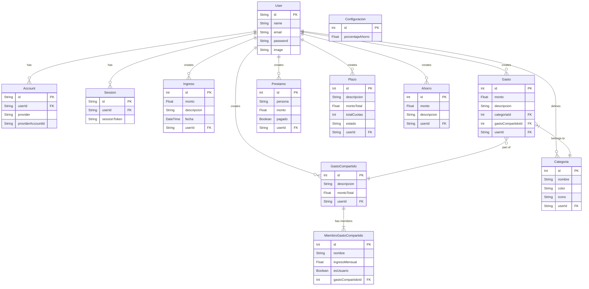

# Documentación de Base de Datos

## Acceso por Consola (CLI)

Para acceder a la base de datos PostgreSQL corriendo en Docker y ejecutar consultas SQL directamente:

1.  Abre una terminal (PowerShell o CMD).
2.  Ejecuta el siguiente comando:

```bash
docker exec -it control-gastos-db psql -U admin -d control_gastos
```

### Comandos Útiles de `psql`

*   `\dt`: Listar todas las tablas.
*   `\d nombre_tabla`: Ver la estructura de una tabla específica.
*   `SELECT * FROM "User";`: Ver todos los usuarios (nota las comillas dobles si la tabla tiene mayúsculas).
*   `\q`: Salir.

---

## Esquema Relacional (ERD)

A continuación se muestra el diagrama entidad-relación de la base de datos actual:


